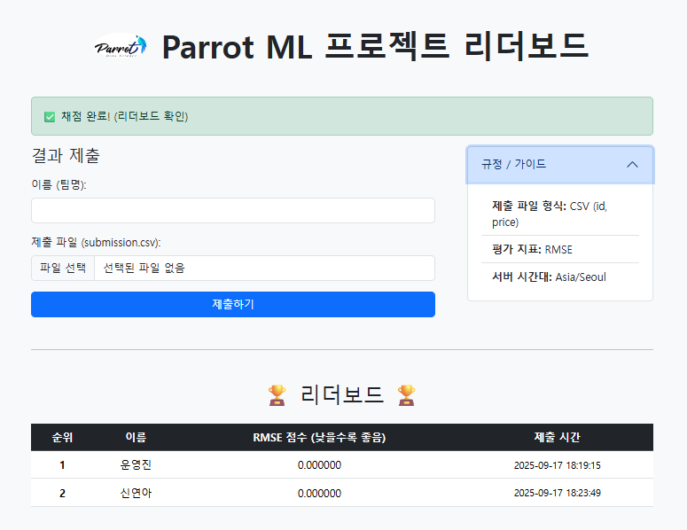
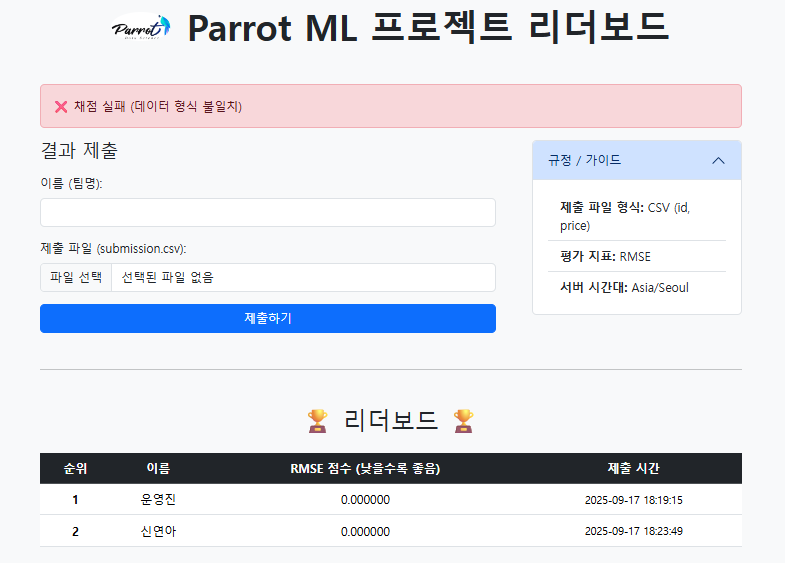

# 🤓 채점 가이드

우리 조가 잘하고 있는지, 궁금하지 않으신가요?\
제출 전 실력을 가늠해볼 수 있도록 리더보드(Leaderboard) 시스템을 준비했습니다!

리더보드 점수는 test 데이터 중 일부를 추출한 leaderboard 데이터를 활용하여 산출됩니다.

csv파일을 업로드하면 아래와 같이 녹색 글씨가 보일 것입니다. 

  

채점은 두 가지로 나뉩니다:
- 💯 **`공개 점수 (Leaderboard Score)`**
  
test 데이터 중 일부(비율은 비공개)를 사용하여 점수를 계산합니다.\
제출 직후 리더보드에 점수가 공개되며, 다른 팀과의 상대적인 위치를 확인할 수 있습니다.

- 🤫 **`비공개 점수 (Test Score)`**
  
원본 test 데이터로 점수를 계산합니다.\
이 점수는 즉시 공개되지 않고, 최종 심사 단계에서만 반영됩니다.

쉽게 말하자면, 최종 제출을 하기 전에 `submission.csv`파일의 일부에 대한 점수를 공개하여 다른 팀과의 격차를 파악할 수 있도록 하는 것입니다\
그러나 리더보드에서 높은 점수를 받더라도 최종 순위가 그대로 유지된다는 보장은 없다는 점을 기억하세요!

# ⚠️ 리더보드 사용시 주의사항

주어진 리더보드 데이터와 row 수가 맞지 않거나 id가 맞지 않는 경우 (주어진 제출 형식과 다른 경우), 아래와 같이 채점이 불가하며 제출이 반려됩니다.\
리더보드에 제출할 때는 `leaderboard_submission.csv` 이름 형식 맞추어 제출해주세요!\
(🚨 `ML프로젝트_0조_test_submission.csv` 와 `leaderboard_submission.csv` 는 다른 파일입니다 🚨)

  

제출 과정에서 보이는 점수는 단순히 참고용이며,
마지막 순간까지 최선을 다해야 한다는 점을 명심하세요 🤖‼️
