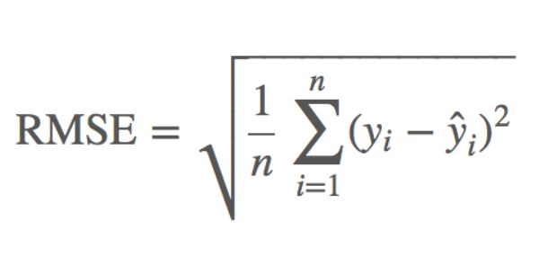

# 🍷 와인의 가격을 예측하다

  

### 🍇 소믈리에: _"좋은 와인은 숫자로 말한다"_  

와인 데이터의 특성을 분석하여,  
**와인 가격 예측 모델을 만들어 주세요!** 🍾  

---

## 🎯 **프로젝트 개요**  
🔍 **Mission**  
- 주어진 `train.csv` 데이터를 이용해 **와인 가격 예측 모델**을 만드세요.  
- `test.csv` 데이터를 기반으로 예측값을 도출하고 `submission.csv`에 작성하세요.  

📊 **Dataset 구조**  
- **train.csv**: `10200 rows × 31 columns`  
- **test.csv**: `2312 rows × 30 columns`
- **leaderboard.csv** : `512 rows x 30 columns`
- **submission.csv**: `2312 rows × 2 columns` (목표 변수 `price`는 0으로 채워져 있음)  

---

## 🍇 **데이터 설명 (Feature Dictionary)**  

| 컬럼명 | 설명 |
| --- | --- |
| `id` | 와인 ID |
| `name` | 와인 이름 |
| `producer` | 생산자(와이너리) |
| `nation` | 원산지 국가 |
| `local1 ~ local4` | 포도 생산 지역 |
| `varieties1 ~ varieties12` | 포도 품종 |
| `type` | 종류 |
| `use` | 용도 |
| `abv` | 도수 |
| `degree` | 시음 온도 |
| `sweet` | 당도 평가 |
| `acidity` | 산도 평가 |
| `body` | 바디감 평가 |
| `tannin` | 탄닌감 평가 |
| `price` | ✅ **목표 변수** (KRW 단위 와인 실제 판매가) |
| `year` | 생산연도 |
| `ml` | 부피 |
---

## 🎯 **평가 지표**  
**RSME (Root Mean Squared Error)**  

RMSE는 예측값과 실제값의 차이를 제곱한 후 평균을 내고, 그 값을 제곱근으로 변환한 값입니다. 
수식은 다음과 같습니다:

  

낮을수록 좋은 점수입니다!

---

### 화이팅! 여러분의 멋진 모델을 기대합니다! 👾
